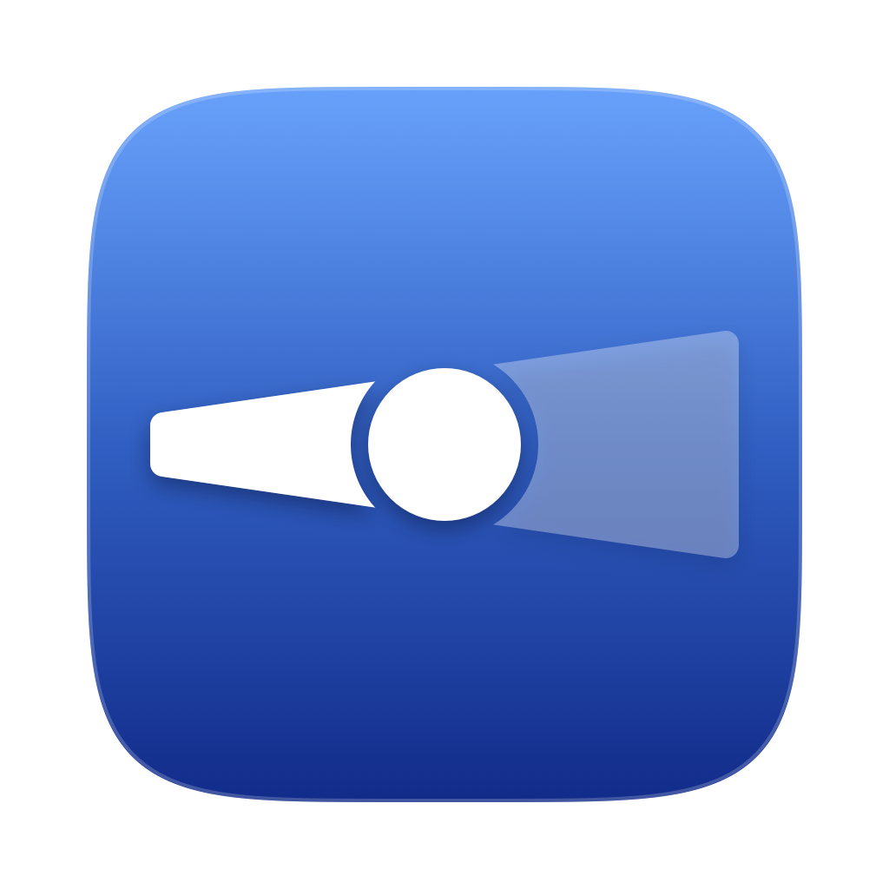
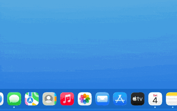
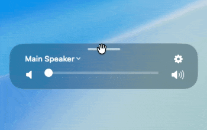

#  Centered Volume

A macOS app that puts the volume HUD back where you are already looking: above
the dock, in the middle of the screen.

macOS 26 (Tahoe) moved the system volume overlay to the top-right corner. On a
34-inch ultrawide, or across three displays, that is a long way from wherever
your eyes happen to be. Centered Volume shows its own HUD instead, centred
above the dock, with the active output device, the level, and the mute state.

## What it does

Change the volume with the keyboard, and the HUD appears above the dock and
fades out about a second later.

The mute key toggles the device's actual mute state and reads it back, so
pressing it again brings the level back exactly where you left it. Nothing is
driven to zero and lost.

Drag it anywhere you like. The position is stored as a share of the screen, so
it lands in the same place when you plug in a different display.

Click the device name to switch output. Every output device the system knows
about is in the list, with its own level and mute state.

## Requirements

macOS 26 (Tahoe) or later. Xcode 26 or newer to build from source.

## Install

Download `Centered-Volume.dmg` from
[the latest release](https://github.com/MariuszT/centered-volume/releases/latest),
drag the app to `/Applications`, and launch it once.

## Settings

Click the gear in the HUD.

| Setting | What it does |
| --- | --- |
| Launch at login | Registers the app with macOS through `SMAppService`. It records wherever the app currently is, so move it to `/Applications` first. |
| Keep the HUD visible while hovering | Stops the auto-hide timer while the cursor is over the HUD, so you can drag the slider without it disappearing. |
| Reset HUD position | Puts the HUD back above the dock, for when you have dragged it somewhere you cannot find. |
| Accessibility access | Lets the app see volume-key presses even when the volume is already at zero or maximum, where macOS stops sending the event. |

## Build from source

    xcodebuild -project CenteredVolume.xcodeproj -scheme CenteredVolume \
      -configuration Release -derivedDataPath build build
    open "build/Build/Products/Release/Centered Volume.app"

## Releasing a signed build

A build other people can open has to be signed with a Developer ID certificate
and notarised by Apple. Copy `.env.example` to `.env` and fill it in with your
Team ID, Apple ID, an app-specific password from appleid.apple.com, your
certificate name, and the app name. Then:

    ./Scripts/sign-and-notarize.sh

It checks that every required variable is set before it touches Xcode, since
the build itself takes a few minutes and a missing credential is cheaper to
catch first. `xcodebuild` then builds and signs the app with the hardened
runtime, using the identity and team from `.env`; the script verifies that
signature rather than re-signing over it, which would silently drop the
entitlements Xcode already applied. From there it archives the app into a zip,
submits it to Apple's notary service, waits for the result, and staples the
notarisation ticket into the app bundle.

## Uninstall

Remove "Centered Volume" from System Settings → General → Login Items, then
delete it from `/Applications`. To clear its preferences as well:

    defaults delete pl.tarnaski.centeredvolume

## How this was built

Vibe coded with Claude Code, start to finish.

## Licence

MIT, see [LICENSE](LICENSE).
